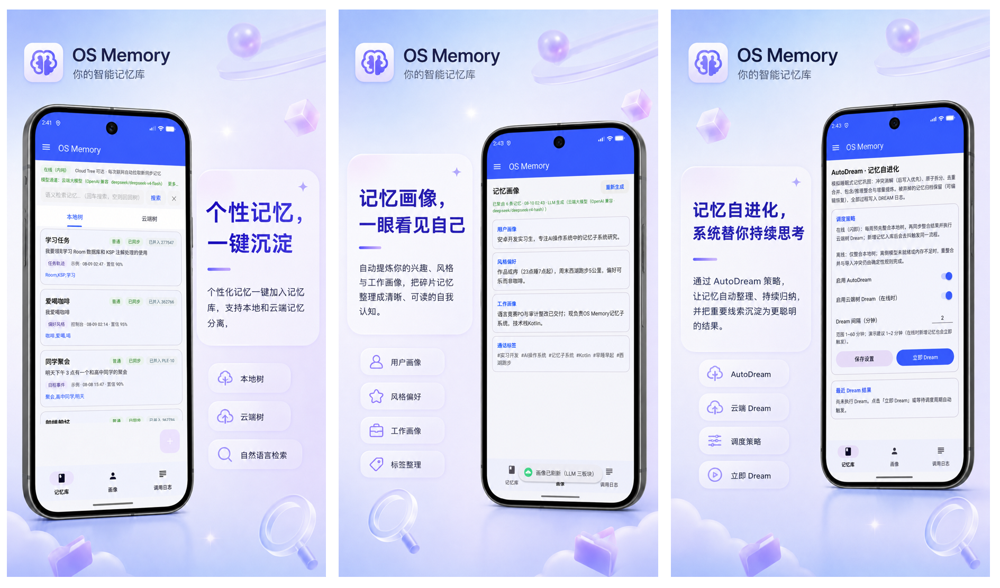
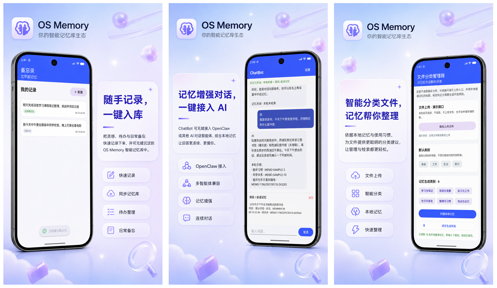
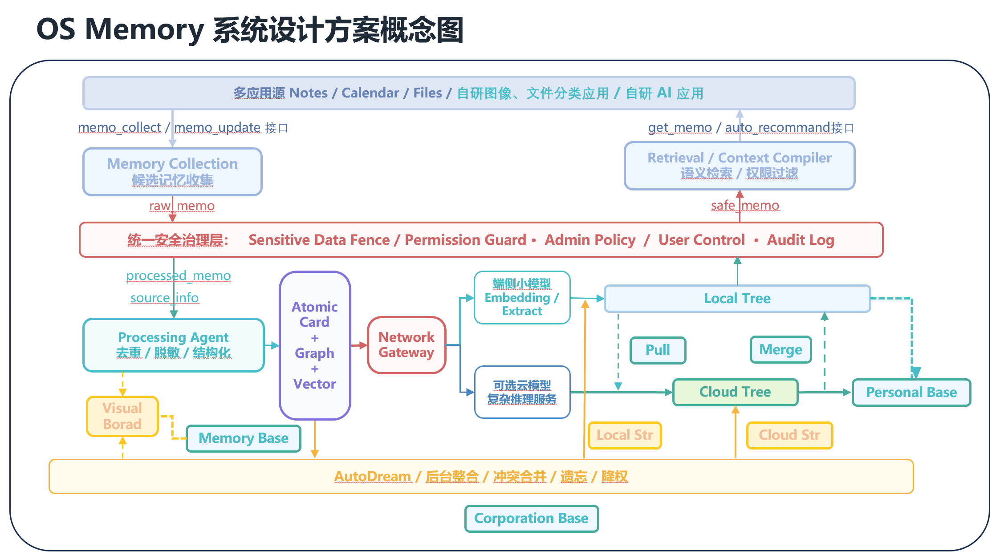

# OS Memory | AI 原生操作系统记忆框架

> OS Memory 是一个面向 Android 的 AI 原生记忆系统原型。随着操作系统从“AI 外挂”向“AI 原生”的演进，我们希望把“记忆”从单个 AI 应用内部的功能，提升为可以被多个应用共享、安全透明且由系统统一管理的用户态服务。
>
> 在这份 README 中，我会带你快速了解项目的设计理念、当前能力和后续方向。如果你关心内部模块、数据结构和调用链路，可以从[架构设计说明](docs/架构设计说明.md)开始；如果你想直接接入业务功能，也可以直接阅读[对外接口文档](docs/对外接口文档.md)和[在 Android Studio 中完整运行](#在-android-studio-中完整运行)。


## 项目简介

现在很多应用都有自己的用户记忆功能（如购物平台，短视频推荐平台），单个AI ChatBot / Agent 的记忆能力也越来越强（如 Claude Code 和 Hermes Agent），而痛点却是它们仍然很难持续理解同一个用户的**跨应用记忆和画像**。用户的偏好散落在聊天记录里，项目上下文停留在某个应用内部，换一个入口之后，很多项目背景、工作上下文都需要重新解释。同时，在特殊政企、军工行业中，记忆的安全透明、可审查和可解释性也变得越来越敏感和关键。

为此，我们开创性地将 AgentOS 与 Kylin AI OS 的思想关联，将 Claude Code、OpenClaw、Hermes、MemOS、CodeX 等 AI Agent 的记忆系统融入操作系统设计，实现了：

- **记忆的进化生命周期循环**：从原始输入到原子记忆，再到整合、遗忘和冲突处理。
- **跨应用记忆流动模型**：备忘录产生的记录可以进入系统记忆，ChatBot 可以在授权范围内检索它，文件分类器也可以基于记忆生成新的分类建议。
- **特殊政企/军工场景的安全敏感策略**：规则门控与模型判断双重保障，敏感记忆不会流出本地安全区。
- **图记忆库组织**：记忆以图结构关联，支持更丰富的上下文推理。
- **本地 / 云端网关与记忆树隔离**：Local Tree 是离线可用的数据源，Cloud Tree 使用独立数据库模拟云端记忆树，保持 Local → Cloud 的单向同步边界。
- **AutoDream 后台记忆整合**：在后台自动进行记忆的合并、去重、高维特征提取，让记忆库持续自我进化。

OS Memory 目前以系统应用形式运行在服务层，可直接接入 Android 系统应用、OpenClaw、飞书/QQ Bot 开放接口、文件和图片分类管理器等自研 AI 应用。项目采用 Kotlin 编写，使用网关双路分离策略：

- **在线时**：使用 OpenAI 兼容的云端模型，提供强大的语义理解。
- **离线时**：控制台“向本地树新增记忆”这条演示链路可使用 Android 设备内的 `llama.cpp` + Qwen2.5 0.5B GGUF 完成结构化抽取，无需云端请求。

项目设计中还预留了更长期的方向，包括记忆的插件化、原生 MCP、Hook、Skills 的转化，AI 应用生态的接入，可参考 [开发路线图](docs/开发路线图.md)，欢迎更多开源社区的贡献者参与到我们的工作中来，期待与你一起致力于打造更智能、更安全的 AI 操作系统记忆基础设施。

## 项目展示





## 系统架构



上图展示了 OS Memory 的系统层级架构和记忆流动设计，自底向上为：

1. **数据存储层**
   - **Local Tree**：基于 Room 的本地数据库，是离线状态下的唯一数据来源，存储所有原子记忆卡片及其图关系。
   - **Cloud Tree**：第二个独立的 Room 数据库，用于模拟联网/内网环境下的云端记忆树，与 Local Tree 保持物理隔离。
   - **审计日志存储**：记录 `COLLECT`、`RETRIEVE`、`INFER`、`SECURITY` 四类操作，便于事后追溯。

2. **记忆治理层**
   - **输入净化**：去除噪声、标准化格式。
   - **安全门控**：基于规则和模型判断敏感等级（`policyLevel=0` 普通，`policyLevel=2` 敏感）。
   - **结构化抽取**：调用云端或端侧模型，将自然语言转换为结构化记忆卡片。
   - **同源去重**：24 小时内相同来源的相似记忆自动合并。
   - **图关联引擎**：为新记忆寻找已有节点，建立语义关系。

3. **服务接口层**
   - **MemoryApiClient**：同进程 Kotlin 客户端，提供增删改查、检索、同步、画像生成等 API。
   - **模型路由**：根据网络状态动态选择云端或端侧模型，并支持手动配置。
   - **权限与审计**：控制应用对记忆的读写权限，记录所有敏感操作。

4. **应用接入层**
   - 控制台（OS Memory 主界面）：管理本地记忆、测试模型、查看审计日志。
   - 示例应用：备忘录、ChatBot、文件分类管理器——展示记忆在不同场景下的流转。
   - 未来可扩展为系统级服务，通过 Binder/AIDL 或 ContentProvider 对外暴露。

**数据流向**：

- **写入流程**：应用 → MemoryApiClient → 净化 → 安全门控 → 结构化抽取 → 去重 → 存入 Local Tree（同时触发 AutoDream 后台处理）。
- **检索流程**：应用 → MemoryApiClient → 关键词召回 → 可选语义重排 → 返回结果（敏感记忆默认过滤）。
- **同步流程**：Local Tree 中 `policyLevel=0` 且非保密标记的记忆，可手动或自动单向同步到 Cloud Tree；敏感记忆永不迁移。
- **审计流程**：所有关键操作（收集、检索、推理、安全事件）写入审计日志，支持导出 HTML 快照。

## OS Memory 接口说明

OS Memory 目前已经是一个完整的闭环项目，**架构原型验证和可行性系统**，为了更好演示系统功能和测试系统效果，我们完成了三个系统应用的小 demo。

对于跨进程身份校验、硬件级密钥保护、多用户隔离、远程云数据库和生产级同步协议等接入生产环境的敏感场景，目前系统支持个性化配置和完善安全策略。

更完整的应用接入说明见 [对外接口文档](docs/对外接口文档.md)。

## 在 Android Studio 中完整运行

### 1. 准备开发环境

建议准备：

- 64 位 Windows、macOS 或 Linux。
- Git 2.x。
- 支持 Android Gradle Plugin `9.3.1` 的 Android Studio。
- JDK 17。优先使用 Android Studio 自带的 JDK。
- 至少 15 GB 可用开发机磁盘空间。首次 Gradle/C++ 构建和 Android 系统镜像都比较大。
- 可访问 Google Maven、Maven Central、GitHub 和 Hugging Face 的网络。

本项目在构建脚本中固定了这些 Android 组件：

| 组件                  | 版本或要求      |
| --------------------- | --------------- |
| Compile SDK           | Android API 37  |
| Min SDK               | API 24          |
| Target SDK            | API 37          |
| Gradle                | Wrapper `9.5.0` |
| Android Gradle Plugin | `9.3.1`         |
| Java                  | 17              |
| NDK                   | `29.0.13113456` |
| CMake                 | `3.31.6`        |
| 端侧运行 ABI          | 仅 `x86_64`     |

在 Android Studio 中打开 **Tools → SDK Manager**：

1. 在 **SDK Platforms** 安装 Android API 37。
2. 在 **SDK Tools** 勾选 Android SDK Platform-Tools、Android SDK Build-Tools、Android Emulator、NDK (Side by side) 和 CMake。
3. 打开 **Show Package Details**，选择 NDK `29.0.13113456` 和 CMake `3.31.6`。
4. 在 **Settings → Build, Execution, Deployment → Build Tools → Gradle** 中把 Gradle JDK 设为 JDK 17。

### 2. 克隆仓库和 llama.cpp 子模块

推荐在第一次克隆时直接包含子模块：

```bash
git clone --recurse-submodules https://github.com/<your-account>/<your-repository>.git
cd <your-repository>
git submodule status
```

如果仓库已经克隆，但 `third_party/llama.cpp` 是空目录，再执行：

```bash
git submodule update --init --recursive
git submodule status
```

`git submodule status` 应显示一个确定的 llama.cpp commit，而不是以 `-` 开头。不要直接把子模块更新到最新版；本项目的 JNI 适配以仓库固定的 revision 为准。

### 3. 用 Android Studio 打开项目

1. 在 Android Studio 欢迎页选择 **Open**。
2. 选择包含 `settings.gradle.kts` 的仓库根目录，不要只打开 `app` 或 `llama-runtime`。
3. 等待 Gradle Sync 完成。第一次会下载 Android/Kotlin 依赖。
4. Android Studio 通常会自动在根目录创建 `local.properties` 并写入 `sdk.dir`。如果没有，请根据本机 SDK 路径创建它。

Windows 示例：

```properties
sdk.dir=C\:\\Users\\YOUR_NAME\\AppData\\Local\\Android\\Sdk
```

macOS 示例：

```properties
sdk.dir=/Users/YOUR_NAME/Library/Android/sdk
```

Linux 示例：

```properties
sdk.dir=/home/YOUR_NAME/Android/Sdk
```

### 4. 配置自己的云端 API Key

项目默认云端配置是一个 OpenAI Chat Completions 兼容端点。不要把真实密钥写进 Kotlin、XML、Gradle 脚本或 README。

最简单的方法是在已经存在的 `local.properties` 末尾追加：

```properties
osmemory.apiKey=YOUR_OPENAI_COMPATIBLE_API_KEY
```

`local.properties` 已被 `.gitignore` 排除，因此普通的 `git add .` 和 `git push` 不会把它提交到仓库。构建脚本会把该值注入当前构建的 `BuildConfig`；应用第一次启动时，仅在设备尚未保存 API Key 的情况下安装它，不会覆盖用户后来在设置页填写的值。

也可以只在本次命令行构建中使用环境变量：

macOS / Linux：

```bash
OS_MEMORY_API_KEY='YOUR_OPENAI_COMPATIBLE_API_KEY' ./gradlew :app:assembleDebug
```

Windows PowerShell：

```powershell
$env:OS_MEMORY_API_KEY='YOUR_OPENAI_COMPATIBLE_API_KEY'
.\gradlew.bat :app:assembleDebug
```

如果要使用其他兼容服务，启动应用后打开 **OS Memory → 左上角菜单 → 模型设置**，填写：

- Base URL：服务的 API 根路径，例如以 `/v1` 结尾的兼容地址。
- 云端 Model ID：服务商实际提供的模型标识。
- API Key：该服务对应的密钥。

点击“测试云端模型”。若设备中已经保存过旧配置，新的 `local.properties` 不会自动覆盖它；请直接在模型设置页修改，或清除应用数据后重新安装。

> API Key 会被编译进你本机生成的 Debug APK，并在首次启动后保存到普通 SharedPreferences。它不会因为 `git push` 自动进入仓库，但能从 APK 或设备中被有能力的人提取。只使用可撤销、低额度的开发密钥，不要公开分发带有真实密钥的 APK。

### 5. 创建 x86_64、16 KB 页大小模拟器

当前端侧库只编译 `x86_64`。ARM64 真机和 ARM64 模拟器无法加载本轮 native runtime。

1. 打开 **Tools → Device Manager**，点击 **Create Virtual Device**。
2. 选择一台 Pixel 设备，例如 Pixel 8 或 Pixel 9。
3. 选择 API 35 或更高、ABI 为 `x86_64` 的 16 KB Page Size 系统镜像。镜像名称或 ABI 通常会包含 `16 KB`、`16k` 或 `sdk_gphone16k_x86_64`。
4. 建议给模拟器至少 4 GB RAM，并确保模拟器数据分区有 1 GB 以上空闲空间。
5. 启动模拟器后可用下面的命令确认：

```bash
adb shell getprop ro.product.cpu.abi
adb shell getconf PAGE_SIZE
```

预期分别看到 `x86_64` 和 `16384`。项目生成的 native `.so` 已按 16 KB 对齐。

### 6. 构建和启动

在 Android Studio 顶部选择 `app` Run Configuration 和刚创建的模拟器，然后点击 **Run**。首次 native 构建可能需要几分钟。

也可以使用命令行：

macOS / Linux：

```bash
./gradlew :app:assembleDebug
```

Windows：

```powershell
.\gradlew.bat :app:assembleDebug
```

Debug APK 会生成在：

```text
app/build/outputs/apk/debug/app-debug.apk
```

手工安装：

```bash
adb install -r -t app/build/outputs/apk/debug/app-debug.apk
```

安装后出现四个桌面入口是正常现象，它们属于同一个包 `com.example.osmemory`，共享同一进程和本地记忆库。

### 7. 第一次准备端侧 Qwen 模型

端侧模型不会随 Git 仓库或 APK 分发。先保持模拟器联网，然后：

1. 打开 **OS Memory**。
2. 点击左上角菜单，进入 **模型设置**。
3. 点击 **测试端侧模型**。
4. 等待下载、SHA-256 校验、模型加载和一次短回复完成。

当前固定模型信息：

| 项目     | 值                                                           |
| -------- | ------------------------------------------------------------ |
| 模型     | Qwen2.5-0.5B-Instruct-GGUF Q4_K_M                            |
| Revision | `9217f5db79a29953eb74d5343926648285ec7e67`                   |
| 文件大小 | `491400032` bytes，约 468.6 MiB                              |
| SHA-256  | `74a4da8c9fdbcd15bd1f6d01d621410d31c6fc00986f5eb687824e7b93d7a9db` |
| 保存位置 | 应用私有 `noBackupFilesDir/models/`                          |

下载期间不应关闭应用或切断网络。卸载应用或清除应用数据后需要重新下载。端侧测试不需要云端 API Key，但下载模型本身需要访问 Hugging Face。

## 相关文档链接


| 文档                                                       | 适合谁读                      | 主要内容                                                 |
| ---------------------------------------------------------- | ----------------------------- | -------------------------------------------------------- |
| [文档中心](docs/README.md)           | 所有读者                      | docs 的统一入口与阅读顺序                                |
| [架构设计说明](docs/架构设计说明.md) | 想理解系统设计的开发者        | 分层架构、记忆流水线、Local / Cloud Tree、模型路由与审计 |
| [对外接口文档](docs/对外接口文档.md) | 准备接入业务的 Android 开发者 | `MemoryApiClient`、权限、DTO、错误与接入示例             |
| [端侧模型说明](docs/端侧模型说明.md) | 关注离线推理的开发者          | llama.cpp、Qwen GGUF、ABI、模型校验与离线验收链路        |
| [开发路线图](docs/开发路线图.md)     | 想了解项目后续方向的贡献者    | 当前已完成能力、仍在规划中的系统化演进方向               |

## 许可证与第三方组件

当前仓库**尚未最终确定 `LICENSE` 文件**。因此，在后续团队补充明确的开源许可证之前，请不要把 OS Memory 项目代码默认视为已经获得 MIT、Apache-2.0 或其他开源许可证授权。

第三方组件仍遵循它们各自的许可证，详情以仓库中的 [`THIRD_PARTY_NOTICES.md`](THIRD_PARTY_NOTICES.md) 为准。当前主要包括：

- **llama.cpp**：MIT License，以 Git submodule 固定 revision 引入。
- **Qwen2.5-0.5B-Instruct-GGUF**：Apache-2.0；模型由用户在运行时下载，不存放在本仓库或 APK 中。

项目自身未来选择的许可证不会替代第三方组件原有的许可与声明要求。

## 交流与贡献

OS Memory 目前仍处于原型快速演进阶段，欢迎围绕记忆系统设计、Android 系统服务、端侧模型、隐私安全和跨应用 AI 体验提交问题、建议与代码贡献。

- 提交 Issue：如果你在运行系统时遇到任何 Bug、环境问题、架构建议和功能讨论都可以通过 GitHub Issues 发起；请尽量附上设备 / 模拟器信息、Android API、复现步骤和相关日志。
- 提交 Pull Request：如果你有改进建议、新功能或者修复，欢迎发起 Pull Request。尽量聚焦单一问题，并说明改动背景、实现方式、验证结果，以及是否影响数据库、模型路由、权限边界或现有 API。
- 文档更新：如果代码改动改变了接口、运行方式、模型版本或系统边界，请同时更新 README 或 `docs/` 中对应文档。
- 如果你觉得本项目对你有有帮助或参考价值，不妨点个 ⭐ 收藏
