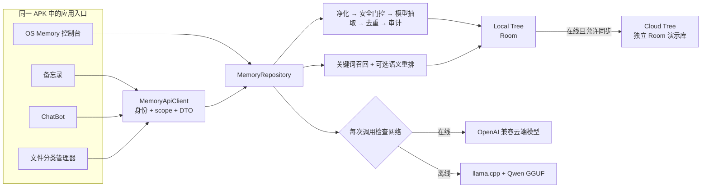

# OS Memory for Android

OS Memory 是一个面向 Android 的 AI 记忆系统原型。它把应用产生的自然语言信息处理成可检索、可审计的“原子记忆”，并围绕记忆的新增、读取、修改、删除，提供本地树、云端树演示、语义检索、安全隔离以及三个配套应用。

当前仓库对应阶段四成果节点：联网时使用 OpenAI 兼容的云端模型；离线时，控制台“向本地树新增记忆”这条演示链可使用 Android 设备内的 llama.cpp + Qwen2.5 0.5B GGUF 完成结构化抽取，不需要向云端模型发请求。

> 本项目目前是研究与演示原型，不是 Android 系统级服务，也不是可直接用于生产环境的个人数据保险箱。请先阅读[当前边界](#当前能力与边界)和[安全注意事项](#安全注意事项)。

## 目录

- [项目背景与阶段演进](#项目背景与阶段演进)
- [当前可以做什么](#当前可以做什么)
- [当前能力与边界](#当前能力与边界)
- [架构概览](#架构概览)
- [在 Android Studio 中完整运行](#在-android-studio-中完整运行)
- [演示当前版本](#演示当前版本)
- [测试与质量检查](#测试与质量检查)
- [常见问题](#常见问题)
- [安全注意事项](#安全注意事项)
- [许可证与第三方组件](#许可证与第三方组件)
- [延伸阅读](#延伸阅读)

## 项目背景与阶段演进

OS Memory 是为了研究“AI 如何拥有持久、可审计、可隔离的记忆”而构建的 Android 原生原型。它不模拟完整的操作系统，而是聚焦记忆的**采集 → 结构化 → 检索 → 隔离 → 审计**闭环，并用三个小应用演示业务功能如何接入这套记忆能力。

仓库用分支记录每个开发阶段的成果，GitHub 上的分支图可以完整看到整个演进过程：

| 阶段 | 对应提交 / 分支 | 主要成果 |
|---|---|---|
| 阶段一：最小可运行系统 | `0548405`（`api-key-warning` 分支的父提交） | 记忆控制台雏形：本地树、模型结构化抽取、关键词检索、审计日志 |
| 阶段二：联网修复与安全 | `phase2-fix` | 双插拔模型网关、云树保守同步策略、自动整合、断网锁定、安全敏感日志、HTML 审计导出 |
| 阶段三：记忆生态应用 | `phase3-dev` | 同进程 `MemoryApiClient` 门面，备忘录 / ChatBot / 文件分类管理器三个应用 |
| 阶段四：离线端侧与打磨（当前节点） | `phase4-dev` | llama.cpp + Qwen2.5 0.5B 离线推理、文档完善、发布准备 |

阶段二、三的成果已经并入阶段四主线，因此**当前 `phase4-dev` 分支就是集成了全部工作的成功版本**。建议把该节点用 Git tag 固定下来（例如 `v0.4.0`），后续实验在 `main` 之外的新分支进行；即使后续开发失败，也能随时回到这个可运行版本。

## 当前可以做什么

### OS Memory 控制台

- 在 Local Tree 中新增、查看、搜索、修改和删除记忆。
- 将文本净化后执行安全门控、模型结构化抽取、24 小时同源去重，再保存为原子记忆卡片。
- 使用关键词召回，并可让模型对候选结果进行语义重排。
- 将普通记忆从本地树单向同步到 Cloud Tree；敏感或主动保密的记忆不会迁移。
- 断网时锁定 Cloud Tree 面板，不把云端内容回拉到本地。
- 根据本地记忆生成用户画像、风格偏好和工作项目信息。
- 查看 `COLLECT`、`RETRIEVE`、`INFER`、`SECURITY` 四类审计日志。
- 导出可由手机浏览器直接打开的自包含 HTML 审计快照。
- 分别测试云端模型和端侧模型是否可用。

### 三个记忆生态应用

安装同一个 APK 后，启动器中会出现 OS Memory 控制台以及三个独立入口：

- **备忘录**：主页面是记录列表；新建或点击记录后进入文字编辑页。记录可关联到 OS Memory，后续修改和删除也可同步到对应记忆。
- **ChatBot**：提供简单问答和“启用 OS Memory”开关。启用后读取本地普通记忆作为上下文，并将模型生成的项目/会话记忆逐条写回记忆系统。
- **文件分类管理器**：提供“伪上传”交互，不读取真实文件；默认包含家庭、工作、生活、旅行四类，可根据本地记忆动态生成新类别。

### 在线与离线模型路由

- 系统检测到有效网络时，模型请求走云端 OpenAI 兼容接口。
- 系统离线时，模型请求只走本机 llama.cpp，不尝试用云端 HTTP 兜底。
- 端侧模型不打包进 APK。第一次点击“测试端侧模型”时下载固定版本 GGUF，并校验文件大小和 SHA-256。
- 当前明确验收的端侧场景只有：**离线 → Local Tree → 新增记忆 → 端侧结构化抽取 → 本地入库**。

## 当前能力与边界

| 项目 | 当前实现 |
|---|---|
| Android 形态 | 一个 APK、一个应用进程、四个 Launcher Activity |
| 应用接入 | 同进程 Kotlin `MemoryApiClient` |
| 跨应用调用 | 尚未实现 Binder/AIDL、ContentProvider 或 HTTP 服务 |
| Local Tree | Room 本地数据库，是离线状态下的数据来源 |
| Cloud Tree | 第二个独立 Room 数据库，用于模拟内网云树及隔离行为；不是远端云数据库 |
| 同步方向 | Local Tree → Cloud Tree 单向同步；不会把云端树内容带回离线本地树 |
| 敏感数据 | 规则门控与模型判断取并集；敏感记忆 `policyLevel=2`，普通应用不可读取且不会同步 |
| 云端模型 | OpenAI Chat Completions 兼容接口，Base URL、Model ID、API Key 可配置 |
| 端侧模型 | llama.cpp + Qwen2.5-0.5B-Instruct Q4_K_M，当前只构建 `x86_64` |
| 文件上传 | 仅为界面伪接口，不申请文件权限、不扫描、不读取、不上传文件 |
| ChatBot 记忆 | 已有项目/会话逐条记忆；全局长期聊天记忆尚未实现 |
| 生产安全 | 数据库和 SharedPreferences 未做硬件级加密；不应存放真实高敏感生产数据 |

更完整的应用接入说明见[对外接口文档](docs/对外接口文档.md)。

## 架构概览



核心目录：

```text
app/src/main/java/com/example/osmemory/
├── core/model/          # 云端模型、端侧模型、动态路由和模型配置
├── core/pipeline/       # 记忆收集、净化、安全门控和结构化抽取
├── core/retrieval/      # 关键词召回和语义重排
├── data/                # Repository、Local/Cloud Room 数据库和审计导出
├── phase3/api/          # 三个应用使用的 MemoryApiClient
├── phase3/notes/        # 备忘录
├── phase3/chat/         # ChatBot
└── phase3/classifier/   # 文件分类管理器

llama-runtime/           # Android/JNI 端侧推理封装
third_party/llama.cpp/   # 固定 revision 的 Git submodule
docs/                    # 设计、接口和阶段说明
```

## 在 Android Studio 中完整运行

### 1. 准备开发环境

建议准备：

- 64 位 Windows、macOS 或 Linux。
- Git 2.x。
- 支持 Android Gradle Plugin `9.3.1` 的 Android Studio。
- JDK 17。优先使用 Android Studio 自带的 JDK。
- 至少 15 GB 可用开发机磁盘空间。首次 Gradle/C++ 构建和 Android 系统镜像都比较大。
- 可访问 Google Maven、Maven Central、GitHub 和 Hugging Face 的网络。

本项目在构建脚本中固定了这些 Android 组件：

| 组件 | 版本或要求 |
|---|---|
| Compile SDK | Android API 37 |
| Min SDK | API 24 |
| Target SDK | API 37 |
| Gradle | Wrapper `9.5.0` |
| Android Gradle Plugin | `9.3.1` |
| Java | 17 |
| NDK | `29.0.13113456` |
| CMake | `3.31.6` |
| 端侧运行 ABI | 仅 `x86_64` |

在 Android Studio 中打开 **Tools → SDK Manager**：

1. 在 **SDK Platforms** 安装 Android API 37。
2. 在 **SDK Tools** 勾选 Android SDK Platform-Tools、Android SDK Build-Tools、Android Emulator、NDK (Side by side) 和 CMake。
3. 打开 **Show Package Details**，选择 NDK `29.0.13113456` 和 CMake `3.31.6`。
4. 在 **Settings → Build, Execution, Deployment → Build Tools → Gradle** 中把 Gradle JDK 设为 JDK 17。

### 2. 克隆仓库和 llama.cpp 子模块

推荐在第一次克隆时直接包含子模块：

```bash
git clone --recurse-submodules https://github.com/<your-account>/<your-repository>.git
cd <your-repository>
git submodule status
```

如果仓库已经克隆，但 `third_party/llama.cpp` 是空目录，再执行：

```bash
git submodule update --init --recursive
git submodule status
```

`git submodule status` 应显示一个确定的 llama.cpp commit，而不是以 `-` 开头。不要直接把子模块更新到最新版；本项目的 JNI 适配以仓库固定的 revision 为准。

### 3. 用 Android Studio 打开项目

1. 在 Android Studio 欢迎页选择 **Open**。
2. 选择包含 `settings.gradle.kts` 的仓库根目录，不要只打开 `app` 或 `llama-runtime`。
3. 等待 Gradle Sync 完成。第一次会下载 Android/Kotlin 依赖。
4. Android Studio 通常会自动在根目录创建 `local.properties` 并写入 `sdk.dir`。如果没有，请根据本机 SDK 路径创建它。

Windows 示例：

```properties
sdk.dir=C\:\\Users\\YOUR_NAME\\AppData\\Local\\Android\\Sdk
```

macOS 示例：

```properties
sdk.dir=/Users/YOUR_NAME/Library/Android/sdk
```

Linux 示例：

```properties
sdk.dir=/home/YOUR_NAME/Android/Sdk
```

### 4. 配置自己的云端 API Key

项目默认云端配置是一个 OpenAI Chat Completions 兼容端点。不要把真实密钥写进 Kotlin、XML、Gradle 脚本或 README。

最简单的方法是在已经存在的 `local.properties` 末尾追加：

```properties
osmemory.apiKey=YOUR_OPENAI_COMPATIBLE_API_KEY
```

`local.properties` 已被 `.gitignore` 排除，因此普通的 `git add .` 和 `git push` 不会把它提交到仓库。构建脚本会把该值注入当前构建的 `BuildConfig`；应用第一次启动时，仅在设备尚未保存 API Key 的情况下安装它，不会覆盖用户后来在设置页填写的值。

也可以只在本次命令行构建中使用环境变量：

macOS / Linux：

```bash
OS_MEMORY_API_KEY='YOUR_OPENAI_COMPATIBLE_API_KEY' ./gradlew :app:assembleDebug
```

Windows PowerShell：

```powershell
$env:OS_MEMORY_API_KEY='YOUR_OPENAI_COMPATIBLE_API_KEY'
.\gradlew.bat :app:assembleDebug
```

如果要使用其他兼容服务，启动应用后打开 **OS Memory → 左上角菜单 → 模型设置**，填写：

- Base URL：服务的 API 根路径，例如以 `/v1` 结尾的兼容地址。
- 云端 Model ID：服务商实际提供的模型标识。
- API Key：该服务对应的密钥。

点击“测试云端模型”。若设备中已经保存过旧配置，新的 `local.properties` 不会自动覆盖它；请直接在模型设置页修改，或清除应用数据后重新安装。

> API Key 会被编译进你本机生成的 Debug APK，并在首次启动后保存到普通 SharedPreferences。它不会因为 `git push` 自动进入仓库，但能从 APK 或设备中被有能力的人提取。只使用可撤销、低额度的开发密钥，不要公开分发带有真实密钥的 APK。

### 5. 创建 x86_64、16 KB 页大小模拟器

当前端侧库只编译 `x86_64`。ARM64 真机和 ARM64 模拟器无法加载本轮 native runtime。

1. 打开 **Tools → Device Manager**，点击 **Create Virtual Device**。
2. 选择一台 Pixel 设备，例如 Pixel 8 或 Pixel 9。
3. 选择 API 35 或更高、ABI 为 `x86_64` 的 16 KB Page Size 系统镜像。镜像名称或 ABI 通常会包含 `16 KB`、`16k` 或 `sdk_gphone16k_x86_64`。
4. 建议给模拟器至少 4 GB RAM，并确保模拟器数据分区有 1 GB 以上空闲空间。
5. 启动模拟器后可用下面的命令确认：

```bash
adb shell getprop ro.product.cpu.abi
adb shell getconf PAGE_SIZE
```

预期分别看到 `x86_64` 和 `16384`。项目生成的 native `.so` 已按 16 KB 对齐。

### 6. 构建和启动

在 Android Studio 顶部选择 `app` Run Configuration 和刚创建的模拟器，然后点击 **Run**。首次 native 构建可能需要几分钟。

也可以使用命令行：

macOS / Linux：

```bash
./gradlew :app:assembleDebug
```

Windows：

```powershell
.\gradlew.bat :app:assembleDebug
```

Debug APK 会生成在：

```text
app/build/outputs/apk/debug/app-debug.apk
```

手工安装：

```bash
adb install -r -t app/build/outputs/apk/debug/app-debug.apk
```

安装后出现四个桌面入口是正常现象，它们属于同一个包 `com.example.osmemory`，共享同一进程和本地记忆库。

### 7. 第一次准备端侧 Qwen 模型

端侧模型不会随 Git 仓库或 APK 分发。先保持模拟器联网，然后：

1. 打开 **OS Memory**。
2. 点击左上角菜单，进入 **模型设置**。
3. 点击 **测试端侧模型**。
4. 等待下载、SHA-256 校验、模型加载和一次短回复完成。

当前固定模型信息：

| 项目 | 值 |
|---|---|
| 模型 | Qwen2.5-0.5B-Instruct-GGUF Q4_K_M |
| Revision | `9217f5db79a29953eb74d5343926648285ec7e67` |
| 文件大小 | `491400032` bytes，约 468.6 MiB |
| SHA-256 | `74a4da8c9fdbcd15bd1f6d01d621410d31c6fc00986f5eb687824e7b93d7a9db` |
| 保存位置 | 应用私有 `noBackupFilesDir/models/` |

下载期间不要关闭应用或切断网络。卸载应用或清除应用数据后需要重新下载。端侧测试不需要云端 API Key，但下载模型本身需要访问 Hugging Face。

## 演示当前版本

### 在线演示

1. 在模型设置页填写自己的云端配置，并点击“测试云端模型”。
2. 回到记忆库，在 Local Tree 点击右下角按钮新增一条普通记忆。
3. 查看卡片中的标题、分类、标签和置信度，再到“调用日志”查看传入与模型抽取记录。
4. 打开左侧菜单，点击“同步到云端”，然后切换到 Cloud Tree 查看允许迁移的记忆。
5. 分别打开备忘录、ChatBot、文件分类管理器，验证关联记忆、带记忆问答和记忆生成类别。
6. 导出审计 HTML，用手机浏览器查看本地树、云端树和日志快照。

### 离线端侧模型演示

必须先按上一节完成端侧模型下载与测试。

1. 在模拟器的快捷设置中关闭网络或开启飞行模式。
2. 回到 OS Memory，确认侧栏显示“离线”，Cloud Tree 被锁定。
3. 留在 Local Tree，点击右下角按钮新增一条记忆。
4. 等待端侧 Qwen 完成抽取。模拟器只使用 CPU，耗时明显长于普通 UI 操作属于正常现象。
5. 确认记忆正常入库，并在调用日志中看到端侧模型通道，而不是云端 HTTP 请求。

本轮没有把备忘录、ChatBot、文件分类管理器的完整离线推理作为验收范围。端侧模型缺失或损坏时，系统不会尝试云端请求；记忆流水线会保留原有的显式降级入库和错误日志，以免无提示丢失用户输入。

## 测试与质量检查

提交代码前建议依次运行：

```bash
./gradlew :app:testDebugUnitTest
./gradlew :app:lintDebug
./gradlew :app:assembleDebug
```

Windows 将 `./gradlew` 替换为 `.\gradlew.bat`。单元测试不调用真实公网模型；端侧 JNI 与实际 GGUF 推理需要在支持的模拟器上手工验证。

如果要检查当前 Git 状态是否误包含密钥或模型：

```bash
git status --short
git check-ignore -v local.properties
git ls-files '*.gguf' '*.ggml' local.properties
```

最后一条命令正常情况下没有输出。

## 常见问题

### CMake 提示找不到 llama.cpp 源码

子模块没有初始化。回到仓库根目录执行：

```bash
git submodule update --init --recursive
```

### 找不到 NDK 29 或 CMake 3.31.6

在 SDK Manager 的 SDK Tools 页打开 **Show Package Details**，安装构建脚本指定的精确版本，然后重新 Sync Project with Gradle Files。

### `Current ABI is not supported` 或 native 库无法加载

当前只支持 `x86_64`。检查 AVD 的 ABI，不要选择 ARM64 镜像。真机 ARM64 支持属于后续工作。

### 端侧模型下载失败或一直未就绪

- 确认模拟器能访问 Hugging Face，并至少有约 1 GB 可用空间。
- 保持应用在前台，重新点击“测试端侧模型”。
- 校验失败时应用会拒绝使用文件，避免加载不完整或版本不一致的 GGUF。
- 企业网络若屏蔽 Hugging Face，需要由网络管理员放行当前固定下载地址；不要随意替换未知模型文件。

### 云端测试返回 401、403 或 404

- `401/403`：检查 API Key、账户权限和模型授权。
- `404`：检查 Base URL 是否为服务商要求的 OpenAI 兼容根路径，通常需要包含 `/v1`；再确认 Model ID 拼写。
- 修改 `local.properties` 后设备仍使用旧 Key：这是“不覆盖用户设置”的预期行为，请在应用模型设置页修改，或清除应用数据。

### 离线新增记忆显示降级

先联网打开模型设置并完成“测试端侧模型”。如果模型未下载、文件校验失败、ABI 不支持或设备内存不足，流水线会明确记录原因并降级保存，不会偷偷调用云端。

### Windows 命令行 Gradle 出现 loopback / AF_UNIX 错误

Android Studio 内构建通常不受影响。PowerShell 可先设置：

```powershell
$env:JDK_JAVA_OPTIONS='-Djdk.net.unixdomain.tmpdir=C:/Windows/Temp'
```

如果使用 `cmd.exe`，改用：

```bat
set JDK_JAVA_OPTIONS=-Djdk.net.unixdomain.tmpdir=C:/Windows/Temp
```

然后在同一个终端中重新运行 Gradle Wrapper。

## 安全注意事项

- 不要提交 API Key、签名 keystore、`.env`、`local.properties` 或 GGUF 权重。仓库已提供相应 `.gitignore`，但提交前仍应检查 staged diff。
- 如果密钥曾经进入任何 commit，仅从最新文件中删除是不够的；Git 历史仍可能包含它。应立即在服务商后台吊销/轮换，并在必要时清理历史后强制推送。
- Debug APK 中的 `BuildConfig` 不是秘密保险箱。不要将带真实 Key 的 APK 上传到 GitHub Release、网盘或公开群组。
- 当前 API Key 保存于普通 SharedPreferences，本地数据库也没有 SQLCipher 等静态加密；本项目只适合演示数据。
- Cloud Tree 当前是设备上的隔离模拟库，不能把它当作已经具备远端鉴权、传输加密、租户隔离和容灾能力的生产云服务。
- 模型输出是不可信输入。当前实现做了 JSON 清洗、安全规则兜底和审计，但仍应避免让模型结果直接触发不可逆外部操作。

## 许可证与第三方组件

当前仓库根目录尚未提供项目自身的 `LICENSE` 文件，因此除第三方组件各自许可的范围外，不应默认认为本项目代码已经以某种开源许可证授权。仓库所有者准备公开协作或允许复用前，应补充明确的项目许可证。

第三方组件信息见 [`THIRD_PARTY_NOTICES.md`](THIRD_PARTY_NOTICES.md)：

- llama.cpp：MIT License，以 Git submodule 固定 revision 引入。
- Qwen2.5-0.5B-Instruct-GGUF：Apache-2.0；由用户运行时下载，不存放在本仓库或 APK 中。

## 延伸阅读

- [当前对外接口文档](docs/对外接口文档.md)
- [阶段四端侧小模型说明](docs/阶段4端侧小模型说明.md)
- [阶段三系统 API 与三个应用说明](docs/阶段3系统API与三应用说明.md)
- [架构设计说明](docs/架构设计说明.md)
- [开发计划](docs/OSMemory开发计划.md)
